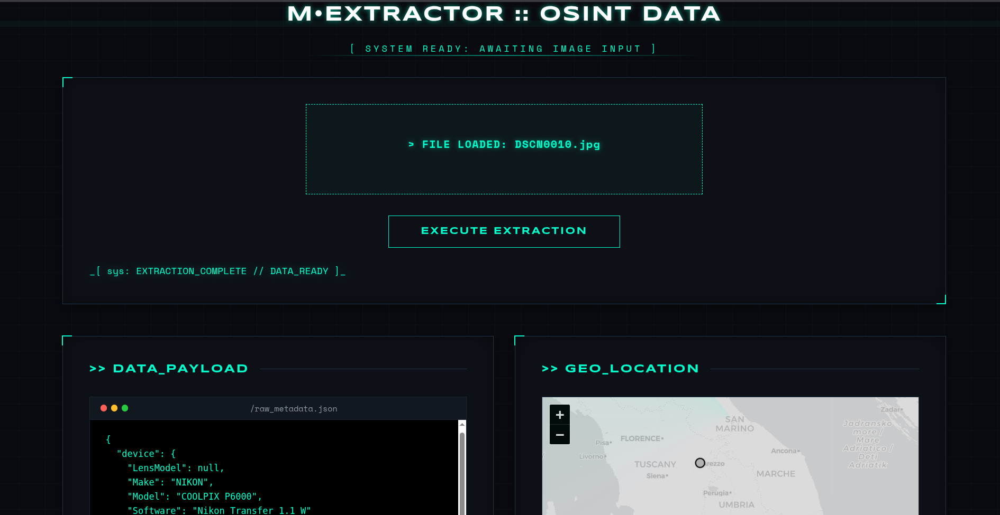

# M•EXTRACTOR :: DIGITAL FORENSICS & OSINT UTILITY

[]()
[]()
[]()

## 01. System Overview & Forensic Objectives

**M•EXTRACTOR** is a high-fidelity diagnostic utility engineered for the extraction, normalization, and verification of embedded image metadata. The primary objective is the acquisition of hardware-level documentation and software provenance to assist in **OSINT (Open-Source Intelligence)** operational triage. 

By executing a recursive sweep of binary file headers, the system captures granular forensic data points critical for establishing a digital chain of custody and verifying image integrity.

---

## 02. Forensic Methodology & Logical Flow

The underlying parser adheres to a rigorous, non-destructive sequence to ensure 100% data recovery:

1.  **Binary Signature Validation:** Bypasses unreliable browser MIME-types by inspecting the "Magic Numbers" at the file offset (e.g., `FF D8 FF` for JPEG).
2.  **Segment Carving:** Identifies and isolates the `APP0` through `APP15` segments within the JPEG stream.
3.  **Recursive Tag Discovery:** Traverses the Image File Directory (IFD) structures, specifically targeting the nested **GPSInfo (Tag 34853)** and **MakerNote (Tag 0x927c)** blocks.
4.  **XMP Reconstruction:** Scans the post-EOI (End of Image) or embedded XML packets for `<?xpacket` signatures to recover edit history and original software UUIDs.

---

## 03. Technical Architecture

The system is built on a **Zero-Persistence (Stateless)** memory model to comply with forensic anti-tampering standards.

* **Volatile Execution:** Leverages Python’s `io.BytesIO` to keep all binary payloads in RAM. No temporary files are generated on the host filesystem.
* **Synchronous Response:** Forensic JSON payloads are delivered via a single transaction, followed by an immediate memory purge.
* **Vanilla HUD:** A zero-dependency JavaScript frontend ensures no third-party tracking or data leakage during the analysis phase.

---

## 04. Tactical Dashboard (HUD)

The Graphical User Interface is designed to minimize cognitive load during high-pressure analysis. It utilizes a state-based HUD (Heads-Up Display) with monochromatic signaling:

* **[STATUS: CYAN]** : Integrity Verified / Data Extracted.
* **[STATUS: RED]** : Verification Failure / Header Corruption / Format Unsupported.



---

## 05. Extracted Data Schema

| Category | Targeted Data Points | Diagnostic Value |
| :--- | :--- | :--- |
| **Device Profile** | Make, Model, BodySerialNumber, Software | Identifies hardware-level origin and firmware version. |
| **Geospatial Intel** | Lat/Lng, Altitude, Timestamp, Reference | Pinpoints exact geographical coordinates via Tag 34853. |
| **Integrity Audit** | XMP History, Orientation, DigitalZoom | Detects digital manipulation and provenance trails. |
| **Visual DNA** | Dominant Hex Colors, Dimensions, Mode | Establishes the visual identity and compression ratio. |

---

## 06. Implementation & Operational Security

### Local Deployment Protocol
To instantiate the isolated environment, execute the following commands:

```bash
# Clone the forensic repository
git clone [https://github.com/organization/m-extractor.git](https://github.com/organization/m-extractor.git) && cd m-extractor

# Instantiate isolated volatile environment
python3 -m venv .venv && source .venv/bin/activate

# Install forensic dependency stack
pip install -r requirements.txt

# Initiate the Flask server on local-loopback
python app.py
```

### Operational Security (OPSEC) Notice

**Volatile Processing Directive:** All assets remain isolated in-memory. The system enforces a hard prohibition on local disk writes (`O_DIRECT` equivalent behavior), ensuring that no forensic artifacts remain on the investigator's machine post-session.

---

Lead Engineer: **Yassine Kamouss**